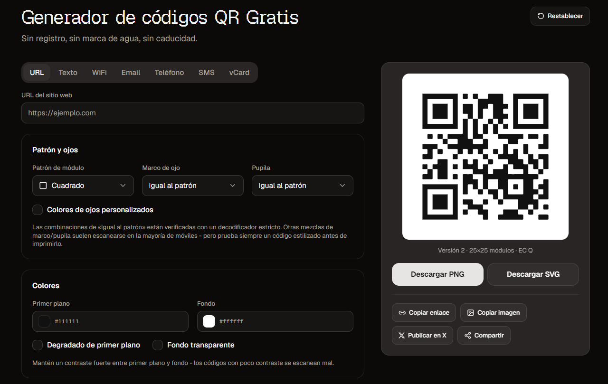

  
  <h1>Generador de códigos QR Gratis</h1>
  

    Genera códigos QR en el navegador — sin registro, sin marca de agua y sin caducidad. 
    URL, texto, WiFi, email, teléfono, SMS y vCard. Descarga PNG o SVG.
  

  

    <a href="https://josejavierdiazglez.github.io/qr-code-generator/"><strong>Demo</strong></a>
    &nbsp;&nbsp;|&nbsp;&nbsp;
    <a href="./SETUP.md"><strong>Setup</strong></a>
    &nbsp;&nbsp;|&nbsp;&nbsp;
    <a href="./LICENSE"><strong>Licencia MIT</strong></a>
  

  

## Demo

Prueba la aplicación en el navegador, sin instalar nada:

**https://josejavierdiazglez.github.io/qr-code-generator/**

## Setup

Para instalar dependencias y desarrollar en local, sigue la guía:

**[SETUP.md](./SETUP.md)**

## Licencia

Distribuido bajo la [licencia MIT](./LICENSE).
